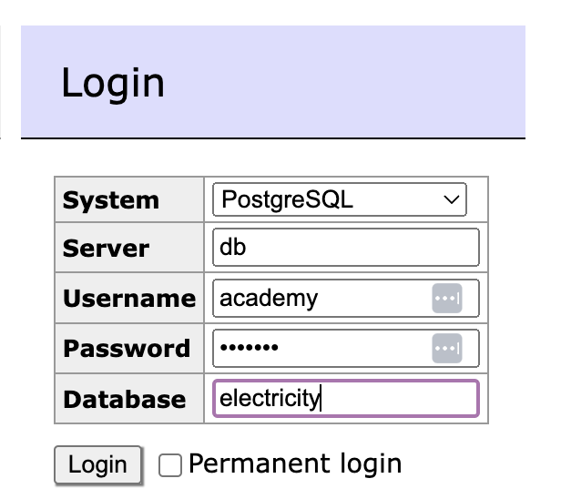

# dev-academy-spring-2026-exercise

This is the pre-assignment for Solita Dev Academy Finland March 2026. But if you’re here just purely out of curiosity, feel free to snatch the idea and make your own app just for the fun of it!

Let's imagine that you have received an interesting project offer to create a UI and a backend service for displaying data from electricity production, consumption and prices.
The exercise uses data that is owned by Fingrid and combines that with electricity price data from porssisahko.net.

# The exercise

Create a web application that uses a backend service to fetch the data. Backend can be made with any technology. We at Solita use for example (not in preference order) Java/Kotlin/C#/TypeScript but you are free to choose any other technology as well.

You are provided with Docker setup, with contains a PostgreSQL database with all the necessary data for the exercise.

You can also freely choose the frontend technologies to use. The important part is to give good instructions on how to build and run the project.

Please return the exercise as a link to github repository.

## Use of Generative AI Tools

We believe in the value of generative AI tools and their role in modern software development. However, in this assignment we want to primarily assess the candidate’s **own problem-solving skills, coding abilities, and way of thinking**.

You may use generative AI tools in a supporting role (for example, to help understand documentation or explore ideas), but we expect the **solution and code to be largely your own work**.

If you wish, you may also briefly describe **where and how you used any such tools** as part of the assignment.

# Stuff to do

## Daily statistics list (recommended features)

- Total electricity consumption per day
- Total electricity production per day
- Average electricity price per day
- Longest consecutive time in hours, when electricity price has been negative, per day

## Additional features for daily statistics list

- Pagination
- Ordering per column
- Searching
- Filtering

## Other additional features

- Single day view
  -- Total electricity consumption per day
  -- Total electricity production per day
  -- Average electricity price per day
  -- Hour with most electricity consumption compared to production
  -- Cheapest electricity hours for the day
- Graph visualisations

## Surprise us with

- Running backend in Docker
- Running backend in Cloud
- Implement E2E tests

# Instructions for running the database

1. Install Docker Desktop on your computer (https://docs.docker.com/desktop/)
2. Clone this repository
3. On command line under this folder run:

```
docker compose up --build --renew-anon-volumes -d
```

Please note that running that might take couple of minutes

4. Docker setup also comes with Adminer UI, where you can check your database contents at http://localhost:8088/
5. Log into Adminer with following information (password: academy):



Database is running at postgres://localhost:5432/electricity and the database name is electricity. Database comes with user academy (password: academy).

# Database structure

Database consists of one table electricityData.

## ElectricityData table

| Column            | Description                                  | Type                 |
| ----------------- | -------------------------------------------- | -------------------- |
| id                | id, primary key                              | integer              |
| date              | date of the data point                       | DATE                 |
| startTime         | Starting time of the hour for the data point | TIMESTAMP            |
| productionAmount  | Electricity production for the hour MWh/h    | NUMERIC(11,5) _NULL_ |
| consumptionAmount | Electricity consumption for the hour kWh     | NUMERIC(11,3) _NULL_ |
| hourlyPrice       | Electricity price for the hour               | NUMERIC(6,3) _NULL_  |
